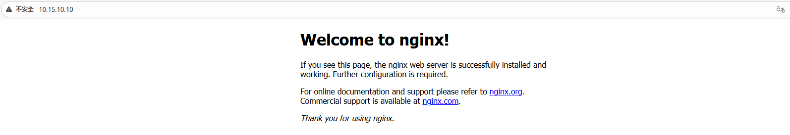
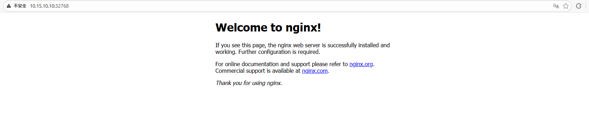

# Docker的基础命令

### 查找镜像
- 查找nginx镜像

```shell
docker search nginx
```
现在docker search <镜像名> 都会显示连接失败无法显示，但是配置好镜像加速之后可以正常docker pull <镜像名:版本号>拉取对应镜像

- 拉取镜像
```shell
docker pull hello-world
Using default tag: latest
#默认拉取最新的镜像
17eec7bbc9d7: Pull complete 
Digest: sha256:d4aaab6242e0cace87e2ec17a2ed3d779d18fbfd03042ea58f2995626396a274
Status: Downloaded newer image for hello-world:latest
docker.io/library/hello-world:latest
#拉取成功
```

- 查看本地镜像
```shell
docker images
REPOSITORY    TAG       IMAGE ID       CREATED        SIZE
hello-world   latest    1b44b5a3e06a   4 months ago   10.1kB
mysql         5.7       5107333e08a8   2 years ago    501MB
#名字         版本号     镜像ID         镜像创建时间    镜像大小
```

- 删除镜像
```shell
docker rmi <镜像ID>
docker rmi 1b4
Untagged: hello-world:latest
Untagged: hello-world@sha256:d4aaab6242e0cace87e2ec17a2ed3d779d18fbfd03042ea58f2995626396a274
Deleted: sha256:1b44b5a3e06a9aae883e7bf25e45c100be0bb81a0e01b32de604f3ac44711634
Deleted: sha256:53d204b3dc5ddbc129df4ce71996b8168711e211274c785de5e0d4eb68ec3851
docker images
REPOSITORY   TAG       IMAGE ID       CREATED       SIZE
mysql        5.7       5107333e08a8   2 years ago   501MB
```
### 容器基础操作
- 直接创造运行一个容器
```shell
docker run nginx
# 会直接在前台展示容器的运行状态，占用前台窗口
/docker-entrypoint.sh: /docker-entrypoint.d/ is not empty, will attempt to perform configuration
/docker-entrypoint.sh: Looking for shell scripts in /docker-entrypoint.d/
/docker-entrypoint.sh: Launching /docker-entrypoint.d/10-listen-on-ipv6-by-default.sh
10-listen-on-ipv6-by-default.sh: info: Getting the checksum of /etc/nginx/conf.d/default.conf
10-listen-on-ipv6-by-default.sh: info: Enabled listen on IPv6 in /etc/nginx/conf.d/default.conf
/docker-entrypoint.sh: Sourcing /docker-entrypoint.d/15-local-resolvers.envsh
/docker-entrypoint.sh: Launching /docker-entrypoint.d/20-envsubst-on-templates.sh
/docker-entrypoint.sh: Launching /docker-entrypoint.d/30-tune-worker-processes.sh
/docker-entrypoint.sh: Configuration complete; ready for start up
2025/12/28 09:19:48 [notice] 1#1: using the "epoll" event method
2025/12/28 09:19:48 [notice] 1#1: nginx/1.29.4
2025/12/28 09:19:48 [notice] 1#1: built by gcc 14.2.0 (Debian 14.2.0-19) 
2025/12/28 09:19:48 [notice] 1#1: OS: Linux 3.10.0-1160.el7.x86_64
2025/12/28 09:19:48 [notice] 1#1: getrlimit(RLIMIT_NOFILE): 1048576:1048576
2025/12/28 09:19:48 [notice] 1#1: start worker processes
2025/12/28 09:19:48 [notice] 1#1: start worker process 29
2025/12/28 09:19:48 [notice] 1#1: start worker process 30
```
- 查看运行中的容器
```shell
docker ps
# 将正在运行中的容器信息打印出来
CONTAINER ID   IMAGE     COMMAND                   CREATED              STATUS          PORTS     NAMES
e6b81cffe57b   nginx     "/docker-entrypoint.…"   About a minute ago   Up 59 seconds   80/tcp    happy_booth
```
- 查看所有已创建的容器
```shell
docker ps -a
# 所有容器的信息打印出来
CONTAINER ID   IMAGE     COMMAND                   CREATED         STATUS                          PORTS     NAMES
e6b81cffe57b   nginx     "/docker-entrypoint.…"   2 minutes ago   Exited (0) About a minute ago
```
- 端口映射
```shell
docker run -d -p 80:80 nginx
# 创建一个<-d>后台运行<-p>将主机的80端口映射到容器的80端口可以通过主机IP+80端口直接访问容器
d90252cb3649d57aae9b2b3bf398123de7c16fe90860cac01b743681d321dcdb
# 容器的完整ID
```


```shell
docker run -d -P nginx
c88b19c4c251007513ba0facecdbb2eeaa4b2e9a06f0b15f5ce5708ce13f6f9c
# -P 暴露容器中所有端口，并且在主机中使用随机端口去映射到这些端口
docker ps
CONTAINER ID   IMAGE     COMMAND                   CREATED          STATUS         PORTS                                     NAMES
c88b19c4c251   nginx     "/docker-entrypoint.…"   10 seconds ago   Up 9 seconds   0.0.0.0:32768->80/tcp, :::32768->80/tcp   recursing_khayyam
```


- 删除容器
```shell
docker rm <容器ID>
# 可以唯一指向的不完整ID也能删除对应的容器
docker ps -a
CONTAINER ID   IMAGE     COMMAND                   CREATED       STATUS                   PORTS                               NAMES
d90252cb3649   nginx     "/docker-entrypoint.…"   2 hours ago   Up 2 hours               0.0.0.0:80->80/tcp, :::80->80/tcp   sleepy_shirley
e6b81cffe57b   nginx     "/docker-entrypoint.…"   2 hours ago   Exited (0) 2 hours ago                                       happy_booth
docker rm e6b8
e6b8
docker rm <容器名字>
docker rm nginx1
nginx1
# docker rm <容器ID> 不能删除正在运行中容器
docker rm d90252cb3649
Error response from daemon: cannot remove container "/sleepy_shirley": container is running: stop the container before removing or force remove
docker rm -f d90252cb3649
d90252cb3649
# -f 是强制删除运行中容器
```
- 停止容器

```shell
docker stop c88b19c
c88b19c
docker ps -a
CONTAINER ID   IMAGE     COMMAND                   CREATED          STATUS                     PORTS     NAMES
c88b19c4c251   nginx     "/docker-entrypoint.…"   16 minutes ago   Exited (0) 6 seconds ago             recursing_khayyam
# 使用容器名字也能停止
docker stop nginx1
nginx1
```
- 启动容器

```shell
docker start c88b19c
c88b19c
docker ps
CONTAINER ID   IMAGE     COMMAND                   CREATED          STATUS         PORTS                                     NAMES
c88b19c4c251   nginx     "/docker-entrypoint.…"   18 minutes ago   Up 3 seconds   0.0.0.0:32769->80/tcp, :::32769->80/tcp   recursing_khayyam
# 使用容器名字也能启动
docker start nginx1
nginx1
```

- 指定容器名字

```shell
docker run -d -p 80:80 --name nginx1 nginx
#  --name 指定容器名字为nginx1
docker ps
CONTAINER ID   IMAGE     COMMAND                   CREATED          STATUS         PORTS                                     NAMES
0f290bad1f2b   nginx     "/docker-entrypoint.…"   3 seconds ago    Up 2 seconds   0.0.0.0:80->80/tcp, :::80->80/tcp         nginx1
```
